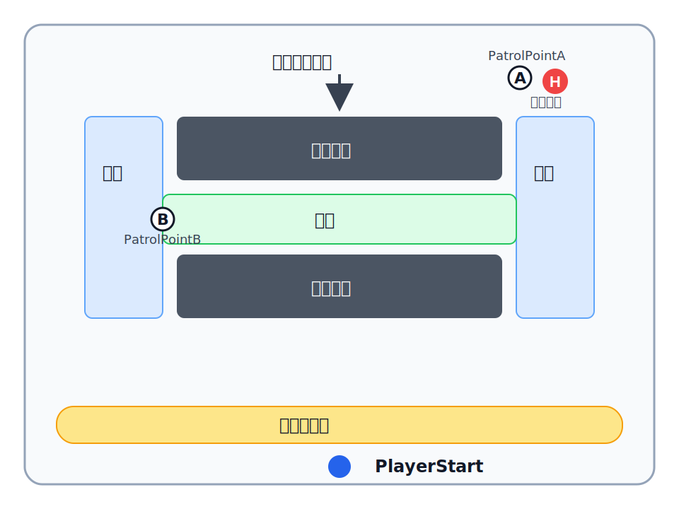

このページでは、2つの地点を巡回し、プレイヤーが警戒エリアに入ると追いかけてくるハンターを作ります。

<Prerequisites>

- Unreal Engine 5でThird PersonのBlueprintプロジェクトを開ける
- Actorをレベルに配置し、移動・回転・拡大縮小を操作できる
- Blueprintを複製し、名前を変更できる
- Event Graphにノードを配置し、ピンを接続できる
- BlueprintをCompile、Saveできる

</Prerequisites>

<Checkpoint title="このページで作るもの">

- ハンターが2つの地点を往復する
- プレイヤーが警戒エリアに入ると、ハンターのライトが赤くなる
- ハンターが巡回をやめ、プレイヤーを追いかける
- ハンターが壁を回り込んで移動する

</Checkpoint>

---

<Section title="作業用のレベルを用意する" goal="テンプレートのレベルを複製し、NIGHT ESCAPE用の作業場所を用意します。">

<Action title="フォルダを作る">

コンテンツドロワーの`Content`直下に、`NightEscape`フォルダを作ります。

その中に、`Blueprints`フォルダと`Maps`フォルダを作ります。

```text
Content/
└── NightEscape/
    ├── Blueprints/
    └── Maps/
```

</Action>

<Action title="レベルを別名で保存する">

メニューから`File`→`Save Current Level As...`を選びます。

保存先に`Content/NightEscape/Maps`を選び、レベル名を`L_NightEscape`にします。

保存後は、`L_NightEscape`を開いたまま作業を進めます。元のテンプレートレベルはそのまま残ります。

</Action>

<Verify title="作業用のレベルを確認する">

- `Maps`フォルダに`L_NightEscape`がある
- エディタ上部に`L_NightEscape`と表示されている
- Playするとプレイヤーキャラクターを操作できる

</Verify>

</Section>

---

<Section title="動作確認用のステージを作る" goal="巡回と追跡を試せる小さなステージを作ります。">

次の図の形にします。`H`はハンター、`A`と`B`はあとで置く巡回地点です。



`NIGHT ESCAPE 2`では、上側の中央に脱出口を配置します。

<Action title="壁とPlayerStartを配置する">

レベルのメッシュは床だけを残し、図のように左側の壁、右側の壁、`PlayerStart`を配置します。

</Action>

<Verify title="ステージの形を確認する">

- `PlayerStart`から、ステージ上側が見える
- 左右と中央の通路から上側まで進める
- 上側の中央に、脱出口を置く空間がある

</Verify>

</Section>

---

<Section title="ハンターが移動できる道を作る" goal="床や壁の形に沿って、ハンターが移動できる道を作ります。">

<Concept title="ハンターが道を探せる範囲">

ハンターは、Navigation Meshを使って目的地までの道を探します。

`P`キーを押すと、ハンターが移動できる床が緑色で表示されます。

</Concept>

<Action title="Nav Mesh Bounds Volumeを配置する">

Place Actorsで`Nav Mesh Bounds Volume`を検索し、レベルに配置します。

Volumeを移動・拡大し、今回使う床全体を覆います。床の上面がVolumeの中に入るように、高さも調整してください。

</Action>

<Action title="移動できる道を表示する">

ビューポートをクリックしてから`P`キーを押します。

床の上に、緑色の範囲が表示されます。

</Action>

<Verify title="Navigation Meshを確認する">

- 床がすべて緑色で表示されている

</Verify>

<Recovery title="緑色の範囲が表示されないとき">

- `Nav Mesh Bounds Volume`がレベルにあるか確認する
- 床の上面がVolumeの中に入っているか確認する
- 床のCollisionが有効か確認する
- ビューポートを選択してから`P`キーを押す

</Recovery>

<Checkpoint title="理解度確認1">

`P`キーで表示される緑色の範囲は、何を表していますか。

<details>
<summary>ヒント</summary>

ハンターが目的地までの道を探すときに使います。

</details>

<details>
<summary>答え</summary>

ハンターが道を探して移動できる範囲です。

</details>

</Checkpoint>

</Section>

---

<Section title="ハンターを作る" goal="プレイヤーキャラクターをもとに、自動で動くハンターを作ります。">

<Action title="ハンター用のBlueprintを作る">

コンテンツドロワーで`BP_ThirdPersonCharacter`を探します。

`BP_ThirdPersonCharacter`を複製して`Content/NightEscape/Blueprints`へ移動し、名前を`BP_Hunter`に変更します。

</Action>

<Action title="プレイヤー用の入力処理を削除する">

`BP_Hunter`を開きます。

Event Graphにある`Move`、`Look`、`Jump`の入力イベントと、そこにつながっているノードを削除します。

ハンターは、このあと作るAIの処理で移動します。

</Action>

<Action title="AIで操作できるようにする">

`BP_Hunter`のClass Defaultsを開き、次の項目を設定します。

| 項目                  | 値                           |
| --------------------- | ---------------------------- |
| `AI Controller Class` | `AIController`               |
| `Auto Possess AI`     | `Placed in World`            |

これで、レベルに配置した`BP_Hunter`はAIControllerによって操作されます。

</Action>

<Action title="ライトを追加する">

Componentsパネルで`Point Light`を追加し、名前を`HunterLight`に変更します。

`HunterLight`をハンターの頭や胸の近くへ移動します。

</Action>

<Action title="ハンターをレベルに配置する">

`BP_Hunter`を、ステージ上側の中央に配置します。`PlayerStart`から見える位置にしてください。

ハンターの足が床に接するように、高さを調整してください。

</Action>

<Action title="ライトを調整する">

配置したハンターの見え方を確認しながら、`HunterLight`の`Light Color`と`Intensity`を調整します。プレイヤーとハンターを見分けられ、ハンターの位置が分かる状態にしてください。

`BP_Hunter`をCompileしてSaveします。

</Action>

<Verify title="ハンターの初期状態を確認する">

Playして確認します。

- プレイヤーとは別のキャラクターが、ステージ上側に見える
- `HunterLight`の光でハンターの位置が分かる
- ハンターが配置した場所に立っている

</Verify>

</Section>

---

<Section title="ハンターを巡回させる" goal="2つの巡回地点を設定し、ハンターを往復させます。">

<Concept title="巡回地点を表すTarget Point">

Target Pointは、レベル内の位置を表すActorです。

今回は、ハンターが巡回するときの目的地として2つ使います。

</Concept>

<Action title="巡回地点を2つ置く">

Place Actorsで`Target Point`を検索し、次の位置に配置します。

| 巡回地点 | 配置する場所 |
| -------- | ------------ |
| `PatrolPointA` | ステージ上側の左側 |
| `PatrolPointB` | ステージ上側の右側 |

World Outlinerで、名前を次のように変更します。

```text
PatrolPointA
PatrolPointB
```

どちらもNavigation Meshの緑色の範囲に置いてください。ハンターは、ステージ上側を左右に巡回します。

</Action>

<Action title="ハンターに巡回地点を設定する">

`BP_Hunter`に、次の変数を作ります。

| 変数名         | 型                              |
| -------------- | ------------------------------- |
| `PatrolPointA` | `Target Point Object Reference` |
| `PatrolPointB` | `Target Point Object Reference` |

2つの変数で`Instance Editable`を有効にします。これで、レベルに置いたハンターごとに巡回地点を設定できます。

続けて、Boolean型の変数`IsChasingPlayer`を作ります。初期値は`false`のままにします。

`IsChasingPlayer`には、ハンターがプレイヤーを追跡中かどうかを記録します。

- `false`：巡回する
- `true`：プレイヤーを追いかける

`BP_Hunter`をCompileしてからレベルへ戻り、レベル上の`BP_Hunter`を選択します。

Detailsで、次のActorを割り当てます。

| 変数           | 割り当てるActor          |
| -------------- | ------------------------ |
| `PatrolPointA` | レベル上の`PatrolPointA` |
| `PatrolPointB` | レベル上の`PatrolPointB` |

</Action>

<Concept title="AI MoveToで目的地へ移動する">

`AI MoveTo`は、AIControllerが操作するキャラクターを、指定したActorや位置まで移動させるノードです。

今回は、2つの巡回地点を交互に目的地にします。

</Concept>

<Action title="巡回地点Aへ移動するイベントを作る">

`BP_Hunter`のEvent GraphにCustom Eventを追加し、名前を`MoveToPatrolPointA`にします。

`Branch`と`AI MoveTo`を追加し、次のように接続します。

```text
MoveToPatrolPointA
    ↓
Branch
Condition: IsChasingPlayer

False
    ↓
AI MoveTo
Pawn: Self
Target Actor: PatrolPointA
Acceptance Radius: 50
```

`IsChasingPlayer`が`false`の間だけ、ハンターが`PatrolPointA`へ向かいます。

</Action>

<Action title="巡回地点Bへ移動するイベントを作る">

Custom Eventを追加し、名前を`MoveToPatrolPointB`にします。

同じように`Branch`と`AI MoveTo`を接続し、目的地だけを`PatrolPointB`に変えます。

```text
MoveToPatrolPointB
    ↓
Branch
Condition: IsChasingPlayer

False
    ↓
AI MoveTo
Pawn: Self
Target Actor: PatrolPointB
Acceptance Radius: 50
```

</Action>

<Action title="2つの巡回イベントをつなぐ">

`MoveToPatrolPointA`側の`AI MoveTo`で、`On Success`から`MoveToPatrolPointB`を呼び出します。

`MoveToPatrolPointB`側では、`On Success`から`MoveToPatrolPointA`を呼び出します。

```text
PatrolPointAへ到着
    ↓
MoveToPatrolPointB
    ↓
PatrolPointBへ到着
    ↓
MoveToPatrolPointA
```

目的地まで移動できない場合、`AI MoveTo`は`On Fail`になります。今回は`On Fail`から次の巡回を始めないため、ハンターはその場で止まります。

</Action>

<Action title="ゲーム開始時に巡回を始める">

`Event BeginPlay`から`MoveToPatrolPointA`を呼び出します。

```text
Event BeginPlay
    ↓
MoveToPatrolPointA
```

`BP_Hunter`をCompileしてSaveします。

</Action>

<Action title="巡回速度を調整する">

Playしてハンターの巡回速度を確認します。調整する場合はPlayを終了し、`Character Movement`の`Max Walk Speed`を変更してから、もう一度Playします。

</Action>

<Verify title="2つの地点を往復するか確認する">

Playして確認します。

1. ハンターが`PatrolPointA`へ向かう
2. 到着すると`PatrolPointB`へ向かう
3. 2つの地点を往復し続ける
4. 壁や曲がり角がある場合は、その形に沿って移動する

</Verify>

<Recovery title="ハンターがまったく動かないとき">

- `BP_Hunter`と2つの巡回地点がNavigation Mesh上にあるか確認する
- レベル上の`BP_Hunter`に、2つの巡回地点が割り当てられているか確認する
- `Event BeginPlay`から`MoveToPatrolPointA`を呼び出しているか確認する
- `AI MoveTo`の`Pawn`に`Self`が接続されているか確認する

</Recovery>

<Recovery title="片方の巡回地点で止まるとき">

- 止まった側の`AI MoveTo`の`On Success`が、反対側のイベントにつながっているか確認する
- 次の巡回地点までNavigation Meshがつながっているか確認する
- `Target Actor`に正しい巡回地点の変数が接続されているか確認する

</Recovery>

<Checkpoint title="理解度確認2">

`PatrolPointA`がNavigation Meshの外にあると、ハンターの巡回はどうなりますか。

<details>
<summary>ヒント</summary>

`AI MoveTo`が目的地まで移動できなかった場合を考えます。

</details>

<details>
<summary>答え</summary>

ハンターは`PatrolPointA`へ到達できません。`AI MoveTo`が失敗し、`On Success`から次の巡回イベントを呼び出せないため、そこで止まります。

</details>

</Checkpoint>

</Section>

---

<Section title="警戒エリアに入ったら追跡を始める" goal="プレイヤーが警戒エリアに入ると、ハンターが追いかけてくるようにします。">

<Action title="警戒エリアのBlueprintを作る">

`Content/NightEscape/Blueprints`に、`Actor`を親にしたBlueprintを作り、名前を`BP_AlertZone`にします。

`Box Collision`を追加して、名前を`AlertCollision`に変更します。

`AlertCollision`を次のように設定します。

| 項目                      | 値                |
| ------------------------- | ----------------- |
| `Collision Presets`       | `OverlapOnlyPawn` |
| `Generate Overlap Events` | 有効              |

`OverlapOnlyPawn`は、プレイヤーキャラクターのようなPawnと重なったことを検出し、移動を妨げない設定です。`Generate Overlap Events`を有効にすると、重なり始めたときにOverlapイベントが発生します。

`AlertCollision`は、図の警戒エリア全体を囲む大きさに広げます。

</Action>

<Action title="警戒エリアにハンターを設定する">

`BP_AlertZone`に、`BP_Hunter Object Reference`型の変数`Hunter`を作ります。

`Instance Editable`を有効にしてからCompileします。

`BP_AlertZone`を、左右の壁、通路、ハンターの巡回場所を囲むように配置します。`PlayerStart`は警戒エリアの外に残します。

レベル上の`BP_AlertZone`を選択し、Detailsの`Hunter`にレベル上の`BP_Hunter`を割り当てます。

</Action>

<Action title="ハンターに追跡処理を作る">

`BP_Hunter`にCustom Eventを追加し、名前を`StartChasingPlayer`にします。

最初に`IsChasingPlayer`を`true`に設定します。

次に、Componentsパネルから`HunterLight`をEvent Graphへドラッグし、`Set Light Color`で赤色に変えます。

最後に、`AI MoveTo`と`Get Player Character`を追加します。

| `AI MoveTo`のピン   | 接続・値                               |
| ------------------- | -------------------------------------- |
| `Pawn`              | `Self`                                 |
| `Target Actor`      | `Get Player Character`の`Return Value` |
| `Acceptance Radius` | `80`                                   |
| `Stop on Overlap`   | 有効                                   |

実行ピンは、次の順番で接続します。

```text
StartChasingPlayer
    ↓
Set IsChasingPlayer
Value: true
    ↓
Set Light Color
Target: HunterLight
New Light Color: 赤
    ↓
AI MoveTo
Target Actor: Get Player Character
```

`Target Actor`にプレイヤーキャラクターを指定すると、ハンターは移動するプレイヤーを追い続けます。

</Action>

<Action title="プレイヤーが入ったら追跡を始める">

`BP_AlertZone`のEvent Graphで、`AlertCollision`の`On Component Begin Overlap`を追加します。

`Other Actor`ピンからドラッグし、`Cast To BP_ThirdPersonCharacter`を追加します。

Cast成功側から、`Hunter`変数を使って`StartChasingPlayer`を呼び出します。

その後、`AlertCollision`の`Set Collision Enabled`を実行し、`New Type`を`No Collision`にします。

```text
AlertCollision
On Component Begin Overlap
    ↓
Cast To BP_ThirdPersonCharacter
Object: Other Actor
    ↓
Hunter
StartChasingPlayer
    ↓
Set Collision Enabled
Target: AlertCollision
New Type: No Collision
```

これで、警戒エリアに入ったときの処理は一度だけ実行されます。

</Action>

<Verify title="巡回から追跡に変わるか確認する">

Playして確認します。

1. Play直後は、通常色のハンターが巡回している
2. 警戒エリアの外からハンターが見える
3. 警戒エリアへ入る
4. ハンターのライトが赤くなる
5. ハンターが巡回をやめ、プレイヤーを追いかける

</Verify>

<Recovery title="警戒エリアに入っても追いかけてこないとき">

- `BP_AlertZone`の`Hunter`に、レベル上の`BP_Hunter`が割り当てられているか確認する
- `AlertCollision`の`Generate Overlap Events`が有効か確認する
- `Other Actor`がCastの`Object`につながっているか確認する
- Cast成功側から`StartChasingPlayer`を呼び出しているか確認する
- `AI MoveTo`の`Target Actor`に`Get Player Character`の`Return Value`が接続されているか確認する

</Recovery>

<Checkpoint title="理解度確認3">

追跡を始めるとき、最初に`IsChasingPlayer`を`true`にするのはなぜですか。

<details>
<summary>ヒント</summary>

巡回イベントの`Branch`が、どちらへ進むかを考えます。

</details>

<details>
<summary>答え</summary>

巡回イベントが再び呼び出されても、`Branch`のFalse側へ進まず、巡回用の`AI MoveTo`を実行しないようにするためです。

</details>

</Checkpoint>

</Section>

---

<Section title="警戒開始の演出を追加する" goal="プレイヤーが見つかると入口が閉じる演出を追加します。">

### 演習1

<Exercise>

プレイヤーが警戒エリアに入ると、通ってきた入口のシャッターが閉じるようにしてください。

`BP_AlarmShutter`を作り、Timelineでシャッターを下へ動かします。`CloseShutter`というCustom EventからTimelineを再生できるようにします。

`BP_AlertZone`から`CloseShutter`を呼び出し、次の状態になれば完成です。

- Play開始時はシャッターが開いている
- 警戒エリアに入ると、ハンターが赤くなって追跡を始める
- プレイヤーの後ろでシャッターが閉じる
- 閉じるシャッターがプレイヤーに重ならない

<Hint>

`BP_AlertZone`に`BP_AlarmShutter Object Reference`型の変数を作り、レベルに配置したシャッターを割り当てます。

</Hint>

<Answer>

`BP_AlarmShutter`にCubeを追加し、入口をふさぐ大きさにします。Timelineの更新中にCubeの位置を上から下へ動かし、`CloseShutter`からTimelineを再生します。

`BP_AlertZone`では、プレイヤーのCast成功側から`StartChasingPlayer`を呼び出したあと、割り当てたシャッターの`CloseShutter`を呼び出します。シャッターを警戒エリアの入口より少し手前へ置くと、プレイヤーが通過したあとに閉じられます。

</Answer>

</Exercise>

<Checkpoint title="完成チェック">

- 床がすべてNavigation Meshの緑色で表示されている
- Play開始時に、通常色のハンターが2つの地点を往復する
- 警戒エリアに入ると、ハンターのライトが赤くなる
- ハンターが巡回をやめ、プレイヤーを追いかける
- ハンターが壁を回り込んで移動する
- 警戒エリアに入ると、入口のシャッターが閉じる

</Checkpoint>

ここからは、時間に余裕がある場合に取り組みます。

### 演習-発展1

<Exercise>

`PatrolPointC`を追加し、ハンターが3つの地点を順番に巡回するようにしてください。

```text
PatrolPointA
    ↓
PatrolPointB
    ↓
PatrolPointC
    ↓
PatrolPointA
```

`PatrolPointC`は、AとBを往復するだけでは通らない場所へ配置します。警戒エリアに入ると3地点の巡回をやめ、プレイヤーを追いかければ完成です。

<Hint>

`PatrolPointC`変数と`MoveToPatrolPointC`を追加し、3つの`AI MoveTo`の`On Success`を順番につなぎます。

</Hint>

<Answer>

`BP_Hunter`に`PatrolPointC`を追加し、レベル上の3つ目のTarget Pointを割り当てます。

`MoveToPatrolPointB`の成功後に`MoveToPatrolPointC`、`MoveToPatrolPointC`の成功後に`MoveToPatrolPointA`を呼び出すと、A→B→C→Aの順に巡回します。各イベントの`Branch`は残し、追跡中は巡回用の`AI MoveTo`を実行しないようにします。

</Answer>

</Exercise>

### 演習-発展2

<Exercise>

プレイヤーを追跡している間だけ、ハンターが巡回中より速く走るようにしてください。

警戒エリアに入る前後で速さの違いが分かり、速くなったあとも壁を回り込んで追跡できれば完成です。

<Hint>

`StartChasingPlayer`の中で、`Character Movement`の`Set Max Walk Speed`を実行します。

</Hint>

<Answer>

`StartChasingPlayer`でライトを赤くしたあとに`Set Max Walk Speed`を追加し、巡回中より速い値を設定します。そのあとに追跡用の`AI MoveTo`を実行します。

Playして、警戒エリアへ入る前は巡回時の速さ、入ったあとは追跡用の速さになることを確認します。

</Answer>

</Exercise>

</Section>

<NextSteps>

次のページでは、ハンターに捕まったときの再スタートと、脱出口に入ったときのゲームクリアを追加します。

</NextSteps>
